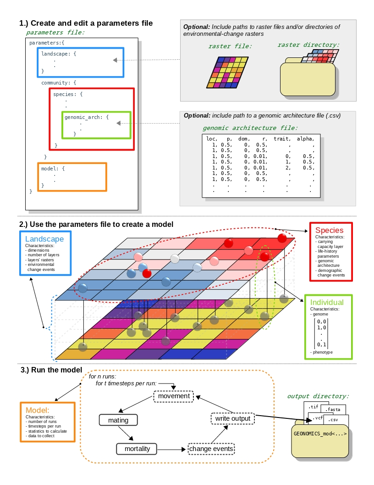
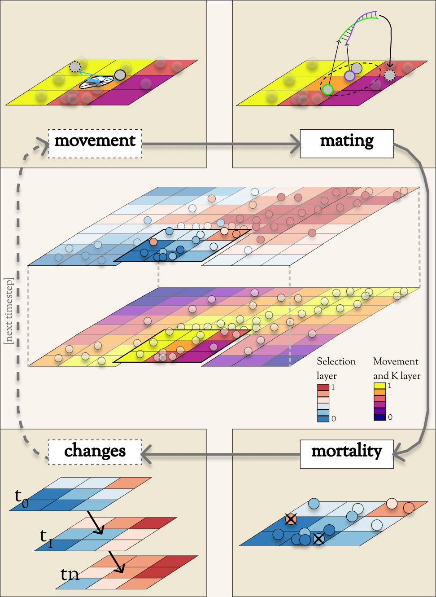

*********
Geonomics
*********

Forward-time, individual-based, landscape genomic simulation in Python.

.. code-block:: python
         
       .                  .   ::::::          :::    :: :::::::::::.           .
                    .::::::    ::::   :::      ::    :: :: ::::::::::: ::.                 .
    .      .     .:::::::::     ::            ::   :::::::::::::::::::::::::.        .   
               .::::::::::                      :::::::::: :::::: ::::::::  ::.
         .   .  : ::::  ::                    ::::  : ::    :::::::: : ::  :    .      .
            . 55555 :3333: 00000   44   44   00000   44   44 111111  66666 55555 .
           . 55     33    00   00  444  44  00   00  44   44   11   66     55     .         .
 .         . 55     33   00     00 44 4 44 00     00 444 444   11   66     555555 .
           . 55 555 3333 00     00 44  444 00     00 44 4 44   11   66         55 .
           . 55   5 33    00   00  44   44  00   00  44   44   11   66        555 .     .
            . 55555 :3333: 00000   44   44   00000   44   44 111111  66666 55555 .         .
      .      .    : ::::::::               :::::::::: ::              ::  :   : .
     .         .:    :::::                    :::::: :::             :::::::  .      .
  .              .    :::                      :::::  ::              ::::: .              . 
           .        .  ::                      ::::                      .
                          . ::                                     .                .
          
 
**Geonomics** allows users to build and run arbitrarily complex, forward-time,
agent-based, and spatially explicit simulations for landscape genomics. It is
designed to allow novice Python users to create sophisticated simulations with
minimal code, while also allowing advanced users a high level of extensibility
and customizability.

We will continue to expand and add functionality in future versions. Please
contact us with questions, suggestions, or requests!

Main Features
-------------
The following is a short list of highlights. For the full monty, please see
the `homepage <https://github.com/drewhart/geonomics>`_,
the `docs <https://geonomics.readthedocs.org>`_,
and the `original methods paper <PAPER_URL_HERE>`_.

    - a model object, which serves as the primary user interface and which
      contains all other model components
    - a landscape object consisting of an arbitrary number of environmental
      raster layers
    - a community object consisting of an arbitrary number of species objects,
      each consisting of an arbitrary number of individuals
    - an optional genomic-architecture object, upon which individuals' genomes
      are based
    - spatialized logistic growth regulating local population densities
    - the capability to model realistic movement and offspring dispersal
      across conductance surfaces
    - neutral and non-neutral evolution capabilities, with spatially contingent
      selection
    - demographic- and environmental-change capabilities
    - the capability to run an arbitrary number of iterations of a model
    - the capability to sample data and a variety of statistics at any desired
      timesteps during a model run
    - numerous visualization methods to aid in model design, exploration,
      analysis, and presentation

Installation
------------

Geonomics can be installed with `pip`:

.. code-block:: python

    pip install geonomics

Quickstart
----------
For impatient beginners, the following code will run Geonomics' default model::

  >>> import geonomics as gnx
  >>> mod = gnx.run_default_model()

This will build and run **geonomics**' default model, return its `Model` object
as `mod`, and leave its parameters file in your current working directory under
the name 'GNX_default_model_params.py'.

For patient folks, the following diagrams should provide more insight, and the
`documentation <https://geonomics.readthedocs.org>`_
provides full details.

Details
-------

Procedural Diagram
~~~~~~~~~~~~~~~~~~

Users can run Geonomics models in as few as three steps.

1. **Create and edit a parameters file**: After importing geonomics as `gnx`,
   users can run the function `gnx.make_parameters_file()` function, feeding in
   a series of arguments to indicate the desired number and type of landscape layers,
   number and parameterization of species, data and statistics to be recorded, and parameters
   file name. Users can then edit the default parameter values in the resulting file to parameterize
   their model. Within the parameters file, they have the option of referencing external files
   to be used by their model, including static raster files or directories of raster time series, as well
   as a CSV file defining a custom genomic architecture.

2. **Use the parameters file to create a model**: After setting up their parameters file, users can
   call the `gnx.make_model()` function, providing their parameters file's name as an argument. This
   will create a new `gnx.Model` object, containing a `gnx.Landscape` with the defined number of layers,
   and a `gnx.Community` with the defined number of species composed of starting individuals. The landscape,
   species, and individuals will all be described by a number of characteristics, in accordance with the values
   defined in the parameters file.

3. **Run the model**: Users can then call the model's `mod.run` or `mod.walk` methods, to either run their model
   to completion or run it manually for some number of time steps. Each time step will include, as applicable,
   movement, mating, mortality, environmental and demographic change, and data-writing operations. For more detail
   on these operations, see the conceptual diagram that follows.

Conceptual Diagram
~~~~~~~~~~~~~~~~~~

Operations during the main phase of a Geonomics model run. In the center is a
species on a multi-layer landscape that includes a selection layer (above) and
a movement and carrying capacity layer (below). Surrounding the landscape is a
flow-diagram of the major operations during a time step. Operations in dashed
boxes are optional.

- **movement**: During the movement stages (top-left), individuals move
  along movement vectors drawn from various distribution options.

- **mating**: During the mating stage (top-right), an individual (purple outline) randomly
  chooses a mate (green outline) from all potential mates within its mating radius
  (dashed circle). The resulting offspring (dashed outline)  disperses from its
  parents' midpoint along a randomly drawn dispersal vector.

- **mortality**: During the mortality stage (bottom-right), deaths are modeled as a Bernoulli
  process, with the probability of mortality being a product of density-dependence
  and selection on all traits.

- **changes**: During the changes stage (bottom-left), demographic change events
  (not pictured) and environmental change events (represented as a
  series of change rasters corresponding to scheduled time steps,
  t1, t2, …, tn), take place.

------------------------------------------------------------------

Attribution
***********

This package was written by Drew Ellison Hart, as part of his PhD work.
It is available to freely distribute and modify, with proper
attribution, under the MIT License. Should you have any questons or
concerns, please feel free to get in touch! (drew.hart <at> berkeley <dot> edu)

-------------------------------------------------------

Disclaimer
----------
**Geonomics** claims no affiliation with the philosophy and economic ideology
`Georgism <https://en.wikipedia.org/wiki/Georgism>`_, sometimes referred to as
'geonomics'. It is a portmanteau of **geo**\graphy and ge\ **nomics**.

We just thought it sounded neat, and found it delightfully confusing.
