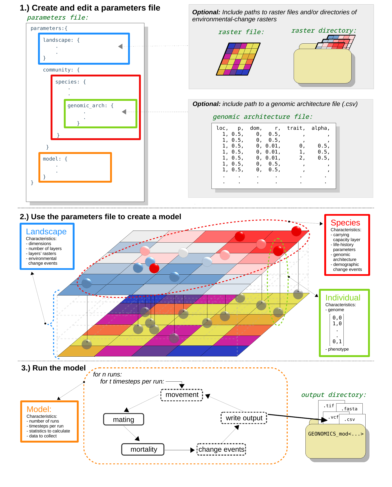

.. role:: py(code)
      :language: python

.. role:: bash(code)
      :language: bash

Getting Started
"""""""""""""""

Installation
************

Geonomics depends on a number of common Python packages. See the
[Dependencies] section below for details.

Installing with `pip`
---------------------

To install Geonomics we recommend using
`pip <https://pypi.org/project/pip/>`. It can be installed by following
the installation instructions on the `pip <https://pypi.org/project/pip/>`
webpage. Geonomics can then be installed using:

.. code-block:: bash

     pip install geonomics

The installation can then be tested by launching a Python prompt and running:

.. code-block:: python
    
    import geonomics as gnx
    gnx.run_default_model()

This will load the Geonomics package, create in your current working
directory a new Geonomics parameters file containing the default
parameter values, then use that file to instantiate and run a Geonomics model.

Dependencies
------------

Required dependencies:
......................

- `numpy <http://numpy.org/>`_

- `matplotlib <http://matplotlib.org/>`_

- `pandas <http://pandas.pydata.org/>`_ (version 0.23.4 or later)

- `geopandas <http://geopandas.org/>`_

- `scipy <http://www.scipy.org/scipylib/index.html>`_

- `scikit-learn <http://scikit-learn.org/stable/>`_

- `statsmodels <http://www.statsmodels.org/stable/index.html>`_ (version
  0.9.0 or later)

- `shapely <http://shapely.readthedocs.io/en/stable/project.html>`_

- `bitarray <http://pypi.org/project/bitarray/>`_

- `pyvcf <http://pyvcf.readthedocs.io/en/latest/>`_

Optional dependencies:
......................

- `nlmpy <http://pypi.org/project/nlmpy/>`_

- `GDAL <http://pypi.org/project/GDAL/>`_

Quick start
***********

**For the beginner**, we recommend the following steps:
  1. Review the diagram of a typical workflow, below.
  2. Read the 'Overview' subsection (below), and the following two sections
     ('Data structures' and 'Operations'), to get a general
     undertsanding of the logic, components, and necessary and optional
     behaviors of a Geonomics model.
  3. Skim the 'Parameters Guide', to understand the structure
     and use of a Geonomics parameters file.
  4. Use `pip` to install Geonomics (:bash:`$ pip install geonomics`);
  5. Open Python and run :py:`import geonomics as gnx`;
  6. Use the `gnx.make_parameters_file` function, to begin
     creating template parameters files that they can tweak as desired;
  7. Use the :py:`gnx.make_model` function and then the
     :py:`Model.walk` or :py:`Model.run` methods to instantiate and run
     the models they've parameterized;
  8. Use the various :py:`Model.plot` methods to visualize
     the behavior and results of their models.

Typical workflow
----------------

*Really* Quick Start
********************

**For the `really impatient` beginner**:
  1. Install Geonomics
  2. Launch Python
  3. Import Geonomics

.. code-block:: python

     >>> import geonomics as gnx
  4. Run the default model, and start mussin' around!

.. code-block:: python
     >>> mod = gnx.run_default_model()

This will load the Geonomics package as `gnx`, create a default Geonomics
parameters file in your current working directory, then use that file
to instantiate and run a :code:`Model` using the default parameter values.

----------------------------------------------------

Overview
********

Geonomics is written in Python, a full-fledged scripting language 
that is relatively easy to learn (and fun!). In Python, it can be pretty quick
for a new user to get up to speed and start doing useful work. For work with
Geonomics, this turnaround time should be even quicker. Geonomics aims to
require minimal Python knowledge (yet maintain high extensibility for
interested, expert users). Essentially, anyone should be able to build their
own, arbitrarily complex Geonomics models as long as they know how to install
the package, open a Python console, call Python functions, and edit some
default values in a pre-packaged script. 

Geonomics will allow you to:

  - create a :py:`Landscape` with any number of :py:`Layers` in it; 
  - create any number of :py:`Species` living on that
    :py:`Landscape`, each of which is composed of a bunch of 
    independent :py:`Individual`\s, and each of which will have a bunch of
    parameters describing what it's like and how it lives;
  - optionally give the :py:`Individual`\s of any :py:`Species`
    genomes, which can optionally determine phenotypes for any number 
    of :py:`Trait`\s (all of this is controlled by the
    :py:`GenomicArchitecture` that you would create for
    the :py:`Species`);
  - simulate any number of timsesteps of the evolution of those
    :py:`Species` on that :py:`Landscape`, where each timestep can include
    movement, mating, mortality (by density-dependence and optionally also by
    natural selection), and demographic, life-history, or
    environmental changes

-----------------------------------------------------------------

Motivation
**********

Backward-time (i.e. coalescent) simulators abound.
But they are inadequate for simulation of many scenarios of 
interest, including: natural selection on traits with arbitrary genomic 
architectures; spatially variable natural selection; simulation of species or
populations distributed continuously and moving realistically across
complex landscapes; complex demographic change simultaneous with ongoing, 
often non-stationary environmental change; and coevolutionary interactions 
between multiple species or incipient species. Few existing forward-time 
simulators can model all of these phenomena, and those that can are incredibly
powerful, but often impose a high cost of entry. Geonomics aims to fill 
this empty niche by combining ease of use with broad extensibility. 
If it succeeds at doing this, Geonomics should prove uniquely useful
for a wide range of purposes, from intro-level educational use to
high-quality theoretical, methodological, empirical, and
applied research.

