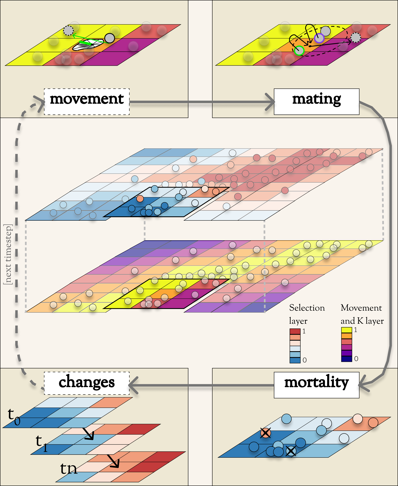
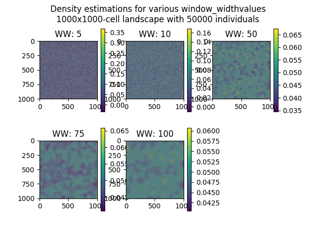
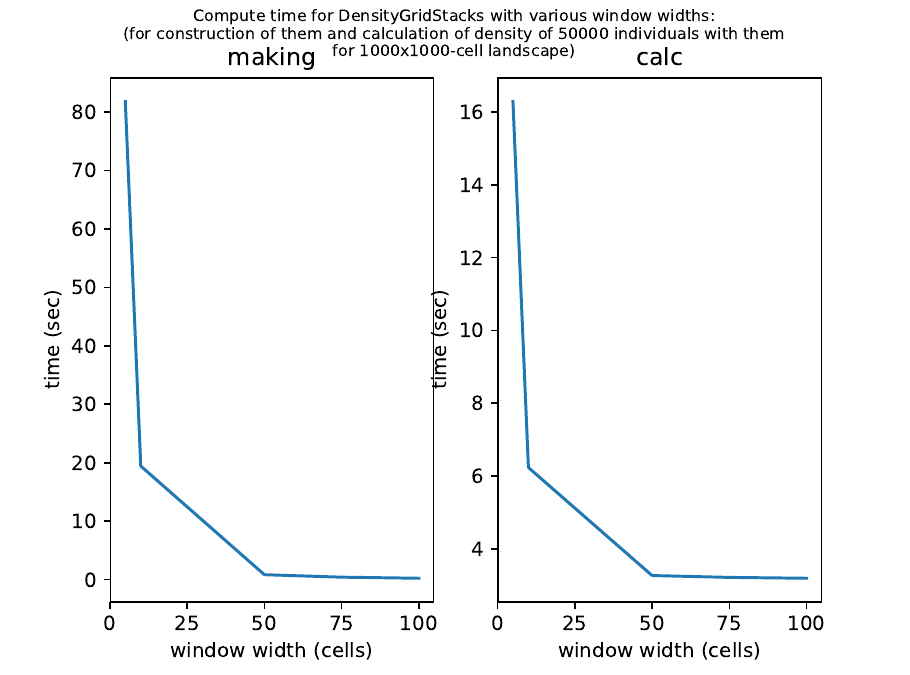

.. role:: py(code)
      :language: python

.. role:: bash(code)
      :language: bash

Model Overview
""""""""""""""
As you're reading, you may want to refer to the :ref:`Conceptual Diagram` as a useful reference.
The primary data structures are depicted in the central image.
Most of the key operations are depicted in the cycle of four corner boxes.

Data structures
***************

The following sections discuss the structure and function of the key
Geonomics classes. Users will interface with these classes more or less
directly when running Geonomics models, so a fundamental understanding of how 
they're organized and how they work will be useful.

:py:`Landscape` and :py:`Layer` objects
=======================================

One of the core components of a Geonomics model is the land. The land is
modeled by the :py:`Landscape` class. This class is an 
integer-keyed :py:`dict` composed of numerous instances of the
class :py:`Layer`. Each :py:`Layer` represents a separate 
environmental variable (or 'layer', in GIS terminology),
which is modeled a 2d Numpy array (or raster; in
attribute 'rast'), of identical dimensions to each 
other :py:`Layer` in the :py:`Landscape`
object, and with the values of its environmental variable 'e' constrained to
the interval [0 <= e <= 1]. Each :py:`Layer` can be initialized from its own
parameters subsection within the 'land' parameters section of a Geonomics
parameters file. 

For each :py:`Species`
(see :ref:`:py:\`Individual\`, :py:\`Species\`, and :py:\`Community\` objects`, below),
the different :py:`Layer` layers in the :py:`Landscape` can be used to model habitat 
viability, habitat connectivity, or variables imposing spatially varying
natural selection. :py:`Landscape` and :py:`Layer` objects
also contain some metatdata (as public attributes), including
the resolution (attribute 'res'), upper-left corner ('ulc'),
and projection ('prj'), which default to 1, (0,0), and None but
will be set otherwise if some or all of the :py:`Layer` layers are read in from
real-world GIS rasters.

-------------------------------------------------------------------------------

Genomes, :py:`GenomicArchitecture`, and :py:`Trait` objects
===========================================================

:py:`Individual` objects 
(see :ref:`:py:\`Individual\`, :py:\`Species\`,
and :py:\`Community\` objects`, below)
can optionally be assigned genomes.
If they are, each :py:`Individual`'s genome is conceptually modeled as a 
2-by-L array (where 2 is the ploidy, currently fixed at
diploidy, and L is the genome length) containing 0s and 1s (because
Geonomics strictly models biallelic SNPs, i.e SNPs with '0'- and '1'-alleles).
(In actuality, Geonomics stores genomes by combining 
Numpy arrays for non-neutral genotypes with a `tskit`_ :py:`TableCollection`
for neutral genotypes and for the current population's spatial pedigree.
Although this makes for more complicated data structures,
it optimizes information retention while minimizing memory usage,
keeping Geonomics fast yet nonetheless enabling powerful
spatiotemporal population genomics research.
See :ref:`:py:\`tskit.tables.TableCollection\``, below, for details.)

The parameter L, as well as numerous other genomic parameters (including 
locus-wise starting frequencies of the 1 alleles; locus-wise dominance effects;
locus-wise recombination rates; and genome-wide mutation rates for neutral, 
globally deleterious, and adaptive loci), are controlled by the 
:py:`GenomicArchitecture` object pertaining to the :py:`Species` to which an 
:py:`Individual` belongs. (For the full and detailed list of attributes in a 
:py:`GenomicArchitecture` object, see its class documentation, below.)
The genomes of the initial :py:`Individual`\s 
in a simulation are drawn, and those of 
:py:`Individual`\s in subsequent generations are recombined (and optionally
mutated) according to the values stipulated 
by the :py:`GenomicArchitecture` of
their :py:`Species`. The user can create a species with a 
:py:`GenomicArchitecture` and with corresponding
genomes by including a 'genome' subsection in that
species' section of the Geonomics parameters file (and 
setting the section's various parameters to their desired values). 

Geonomics can model :py:`Individual`\s' phenotypes.
It does this by allowing the 
user to create an arbitrary number of distinct :py:`Trait`\s
for each :py:`Species`. Each trait is
represented by a :py:`Trait` object, which 
maps genomic loci onto that trait, maps effect sizes ('alpha') onto those loci,
and sets the trait's polygenic selection
coefficient ('phi'). An :py:`Individual`'s
phenotype for a given trait is calculated as the 'null phenotype' plus a 
weighted sum of the products of its 'effective genotypes' at all loci 
underlying that :py:`Trait` and the effect sizes (i.e. 'alpha') of those loci:

.. math::

   z_{i,t} = null\_genotype + \sum_{l = 0}^{n} \alpha_{t,l} g_{i,l}

where :math:`z_{i,t}` is the phenotype of :py:`Individual` i for trait t, 
:math:`g_{i, l}` is the effective genotype of :py:`Individual` :math:`i`
at locus :math:`l`, and 
:math:`\alpha_{t,l}` is the effect size of locus :math:`l` for trait :math:`t`.

The 'null phenotype' represents the phenotypic value for
an :py:`Individual` who is homozygyous for
the 0 allele at all loci for a trait.
For monogenic traits the null phenotype is 0 and the effect size is fixed at 
0.5 (such that individuals can have phenotypes of 0, 0.5, or 1); 
for polygenic traits the null phenotype is 0.5 and effect sizes can be fixed 
at or distributed around a mean value (which is controlled in the 
parameters file).

The 'effective genotype' refers to how the genotype is calculated based on the 
dominance at a locus, as indicated by the following table of genotypes:

+--------------------+------------------+------------------+
| Biallelic genotype |   Codominant     |     Dominant     |
+====================+==================+==================+
|      0 : 0         |        0         |        0         |
+--------------------+------------------+------------------+
|      0 : 1         |       0.5        |        1         |
+--------------------+------------------+------------------+
|      1 : 1         |        1         |        1         |
+--------------------+------------------+------------------+

(For the full and detailed list of attributes in a :py:`Trait` object, 
see its class documentation, below.)

Note that for maximal control over the :py:`GenomicArchitecture`
of a :py:`Species`, the user can set the value of the 'gen_arch_file' 
parameter in the parameters file to the name of a separate CSV file 
stipulating the locus numbers, starting 1-allele frequencies, dominance 
effects, traits, and inter-locus recombination rates (as columns) of 
all loci (rows) in the :py:`GenomicArchitecture`;
these values will override any other values provided in the 'genome' 
subsection of the species' parameters.

-------------------------------------------------------------------------------

:py:`Individual`, :py:`Species`, and :py:`Community` objects
============================================================

Being that Geonomics is an individual-based model, individuals serve as 
the fundamental units (or agents) of all simulations. They are represented by
objects of the :py:`Individual` class.
Each :py:`Individual` has an index (saved 
as attribute 'idx'), a sex (attribute 'sex'), an age (attribute 'age'), 
an x,y position (in continuous space; attributes 'x' and 'y'), and a 
:py:`list` of environment values (attribute 'e'), extracted from the 
:py:`Individual`'s current cell on each :py:`Layer`
of the :py:`Landscape` on which the :py:`Individual` lives.

The :py:`Species` class is an :py:`OrderedDict`
(defined by the :py:`collections` 
package) containing all :py:`Individaul`\s, (with 
their 'idx' attributes as keys). If a :py:`Species`
has a :py:`GenomicArchitecture` then the :py:`Individual`\s
in the :py:`Species` will also each have genomes (attribute 'g'),
and the :py:`GenomicArchitecture` includes :py:`Trait`\s
then each individual will also have a :py:`list` of 
phenotype values (one per :py:`Trait`; attribute 'z') and a 
single fitness value (attribute 'fit'). (These attributes all otherwise 
default to :py:`None`.)

Each :py:`Species` also has a number of other attributes of interest. Some 
of these are universal (i.e. they are created regardless of the 
parameterization of the :py:`Model` to which a :py:`Species` inheres). These 
include: the :py:`Species`' name (attribute 'name'); its current density 
raster (a Numpy array attribute called 'N'); and the number of births,
number of deaths, and terminal population size (i.e. total number of
individuals in the :py:`Species`) of each timestep (which are 
:py:`list` attributes called 'n_births', 'n_deaths', and 'Nt'). If the 
:py:`Species` was parameterized with a
:py:`GenomicArchitecture` then that will 
be created as the 'gen_arch' attribute (otherwise this attribute will be 
:py:`None`).

All of the :py:`Species` in a :py:`Model`
are collected in the :py:`Model`'s 
:py:`Community` object. The :py:`Community` class
is simply an integer-keyed :py:`dict` 
of :py:`Species`. For the time being, the :py:`Community` object allows a 
Geonomics :py:`Model` to simulate multiple :py:`Species` simultaneously on 
the same :py:`Landscape`, but otherwise affords no additional functionality
of interest. However, its implementation will facilitate the potential 
future development of methods for interaction between :py:`Species`. 
(e.g. to simulate coevolutionary, speciation, or hybridization scenarios).

-------------------------------------------------------------------------------

:py:`Model` Objects
===================

Objects of the :py:`Model` class serve as the main interface between the user 
and the Geonomics program. (While it is certainly possible for a user 
to work directly with the :py:`Landscape`
and :py:`Species` or :py:`Community` objects to 
script their own custom models, the typical user should find that the 
:py:`Model` object allows them accomplish their goals with minimal toil.)
The main affordance of a :py:`Model` object is the :py:`Model.run` method, 
which, as one could guess, will run the :py:`Model`. The typical workflow 
for creating and running a  :py:`Model` object is as follows:

  1. Create a template paramters file containing the desired sections, 
     by calling :py:`gnx.make_parameters_file` with all revelant arguments;
  2. Define the scenario to be simulated, by opening and editing that 
     parameters file (and optionally, creating/editing corresponding 
     files, e.g. genomic-architecture CSV files;
     or raster or numpy-array files to be used as :py:`Layer`\s);
  3. Instantiate a :py:`Model` object from that parameters file, by calling 
     :py:`mod = gnx.make_model('/path/to/params_filename.py')`;
  4. Run the :py:`Model`, by calling :py:`mod.run()`.

For detailed information on usage of these functions, see their docstrings.
When a :py:`Model` is run, it will:

  1. Run the burn-in (until the mininmal burn-in length stipulated in the 
     parameters file and the built-in stationarity statistics 
     determine that the burn-in is complete);
  2. Run the main model for the stipulated number of timesteps;
  3. Repeat this for the stipulated number of iterations (retaining or 
     refreshing the first run's initial :py:`Landscape` and :py:`Species` 
     objects as stipulated).

The :py:`Model` object offers one other method, however, :py:`Model.walk`, 
which allows the user to run a model, in either 'burn' or 'main' mode, 
for an arbitrary number of timesteps within a single iteration (see its 
docstring for details). This is particularly useful for running 
Geonomics within an interactive Python session. Thus, :py:`Model.walk` is 
primarily designed for passively running numerous iterations of a :py:`Model`, 
to generate data for analysis, whereas :py:`Model.walk` is primarily designed
for the purposes of learning, teaching, or debugging the package, or 
developing, exploring, introspecting, or visaulizing particular :py:`Model`\s. 

-------------------------------------------------------------------------------

Secondary (i.e. private) classes
================================

The typical user will not need to access or interact with the following 
classes in any way. They will, however, parameterize them in the 
parameters file by either leaving or altering their default values. Geonomics 
sets generally sensible default parameter values wherever possible, 
but for some scenarios they may not be adequate, and for some parameters 
(e.g. the window-width used by the _DensityGridStack; see below), there is 
no "one-size-fits-most" option. Thus, it is important that the user
have a basic acquaintance with the purpose and operation of these classes.

:py:`_ConductanceSurface`
-------------------------

The :py:`_ConductanceSurface` class allows Geonomics
to model a :py:`Species`' 
realistic movement across a spatially varying landscape. It does this by 
creating an array of circular probability distributions (i.e. VonMises 
distributions), one for each cell on the :py:`Landscape`, from which 
:py:`Individual`\s choose their directions each time they move. To create the
:py:`_ConductanceSurface` for a :py:`Species`,
the user must indicate the :py:`Layer` 
that should be used to create it (i.e. the :py:`Layer` that represents 
landscape permeability for that :py:`Species`). 
The :py:`_ConductanceSurface`'s 
distributions can be **simple (i.e. unimodal)**, such that the 
maximum value of the distribution at each cell will point toward the
maximum value in the 8-cell neighborhood; this works best for permeability 
:py:`Layer`\s with shallow, monotonic gradients, because the differences 
between permeability values of neighboring cells can be minor (e.g. a 
gradient representing the directionality of a prevalent current). 
Alternatively, the distributions can be **mixture (i.e. multimodal)**
distributions, which are weighted sums of 8 unimodal distributions, one 
for each neighboring cell, where the weights are the relative cell 
permeabilities (i.e. the relative probabilities that an :py:`Individual` would 
move into each of the 8 neighboring cells); this works best for non-monotonic, 
complex permeability :py:`Layer`\s (e.g. a DEM of a mountainous region that is 
used as a permeability :py:`Layer`). 
(The :py:`Landscape` is surrounded by a margin of 0-permeability 
cells before the :py:`_ConductanceSurface` is calculated, such 
that :py:`Landscape` edges are treated 
as barriers to movement.) The class consists 
principally of a 3d Numpy array (y by x by z, where y and x (a.k.a i and j, 
or latitude and longitude) are the dimensions of the 
:py:`Landscape` and z is the length of the vector of values 
used to approximate the distributions in each cell.

:py:`_DensityGridStack`
-----------------------

The :py:`_DensityGridStack` class implements an algorithm for rapid estimating 
an array of the local density of a :py:`Species`. The resulting array has a 
spatial resolution equivalent to that of the :py:`Landscape`,
and is used in all density-dependent operations (i.e. for controlling 
population dynamics). The density is estimated 
using a sliding window approach, with the window-width determining the 
neighborhood size of the estimate (thus essentially behaving like a smoothing
parameter on the density raster that is estimated, with larger window widths
producing smoother, more homogeneous rasters). The window width can be
controlled by setting the 'density_grid_window_width' parameter in the 
'mortality' section of the :py:`Species` parameters, in a parameters file;
however, if the default value (:py:`None`) is left then the window width will
default to 1/20th of the width of the :py:`Landscape`. 
Note that setting the window width to a value less than ~1/20th of the
:py:`Landscape` width is likely to result
in dramatic increases in runtime, so this is generally advised against (but
may be necessary, depending on the user's interests). The following plot
show the estimated density rasters for a 1000x1000-cell :py:`Landscape` with
a population of 50,000 individuals, using various window widths:

And this plot shows how :py:`_DensityGridStack` creation
(plot titled 'making') and runtime (plot titled 'calc')
scale with window-width for that :py:`Landscape`:

:py:`_KDTree`
-------------

The :py:`_KDTree` class is just a wrapper around :py:`scipy.spatial.cKDTree`. 
It provides an optimized algorithm (the kd-tree) for finding 
neighboring points within a given search radius.
This class is used for all neighbor-searching operations (e.g. mate-search).

:py:`tskit.tables.TableCollection`
----------------------------------

To enable easy recording of the pedigree of a simulated :py:`Species`,
Geonomics depends on the Python package `tskit`_ (software
that originated as improvements made to the data structures
and algorithms used by the popular forward-time simulator `msprime`_).
Geonomics uses the :py:`tskit` tables API to store the full history of
individuals, genotypes, mating events, and recombinations for
a :py:`Species` in a :py:`TableCollection` object.
This data structure is initiated with a random pedigree
that is backwards-time simulated using :py:`msprime`
and used as a stand-in (viz. meaningless) pedigree
for a :py:`Species`' starting population.
It is then updated with each timestep's forward-time simulation information,
and it is periodically simplified as recommended by the :py:`tskit` authors
using :py:`tskit`'s simplification algorithm.
(The simplification interval can be parameterized by the user.)
Because each individual is stored along with its x,y birth location,
a :py:`TableCollection` thus
contains the full spatial pedigree of a :py:`Species`' current population.
Geonomics additionally provides some wrapper functions,
implemented as :py:`Species` methods,
for converting the :py:`TableCollection` to a :py:`TreeSequence`,
and for calculating statistics and creating visualizations from these
two data structures. (For further details regarding :py:`tskit`,
see the Python package
`documentation <https://tskit.readthedocs.io/en/latest/index.html>`_
and the associated peer-reviewed
`paper <https://journals.plos.org/ploscompbiol/article?id=10.1371/journal.pcbi.1006581>`_.)

:py:`_RecombinationPaths`
-------------------------

The :py:`_RecombinationPaths` class contains a large (and customizable) 
number of :py:`bitarray`\s, each of which indicates the genome-length 
diploid chromatid numbers (0 or 1) for a
recombinant gamete produced by an :py:`Individual` of a given :py:`Species` 
(henceforth referred to as 'recombination paths'). These recombination 
paths are generated using the genome-wide recombination rates specified by 
the :py:`Species`' :py:`GeonomicArchitecture`. They are generated during 
construction of the :py:`Model`, then drawn randomly as needed (i.e.
each time an :py:`Individual` produces a gamete). This provides a 
reasonable trade-off between realistic modelling of recombination and runtime.

:py:`_LandscapeChanger` and :py:`_SpeciesChanger`
-------------------------------------------------

These classes manage all of the landscape changes and demographic changes 
that were parameterized for the :py:`Landscape` and
:py:`Species` objects to which they inhere. 
The functions creating these changes are defined at the outset, 
then queued and called at their scheduled timesteps.

:py:`_DataCollector` and :py:`_StatsCollector`
----------------------------------------------

These classes manage all of the data and statistics that should be collected 
and written to file for the :py:`Model` object to which they inhere 
(as determined by the parameters file used the create the :py:`Model`). 
The types of data to be collected, or statistics to be calculated, as 
well as the timesteps at which and methods by which they're 
collected/calculated and determined at the outset, then the 
appropriate functions called at the appropriate timesteps.

Operations
**********

The following sections discuss the mechanics of core Geonomics operations. 

Movement and Dispersal
======================

Movement is optional, such that turning off movement will allow the user 
to simulate sessile organisms (which will reproduce and disperse, 
but not move after dispersal; this distinction is of course irrelevant 
for a :py:`Species` with a maximum age of 1). For :py:`Species` 
with movement, :py:`Individual`\s can
move by two distinct mechanisms. **Spatially random movement**
is the default behavior; in this case, :py:`Individual`\s 
move to next locations that are determined by a random distance drawn 
from a Wald distribution and a random direction drawn from a uniform 
circular (i.e. Von Mises) distribution.  As with most distributions used 
in Geonomics, the parameters of these distributions have sensible 
default values but can be customized in a :py:`Model`'s parameters file 
(see section 'Parameters', below). 

The alternative movement mechanism that is available is 
**movement across a permeability surface**,
using a :py:`_ConductanceSurface` object.
To parameterize a :py:`_MovemementSurface` for a :py:`Species`, the user 
must create a template parameters file that includes the 
necessary parameters section for the :py:`Species` (i.e. 
the user must set 'movement' to :py:`True` and 'movement_surface' to :py:`True` 
in the :py:`Species`' arguments to the :py:`gnx.make_parameters_file` 
function (see the docstring for that function for details and an example). 
:py:`Individual`\s move to next locations determined by a random distance drawn 
from a Wald distribution and a random direction drawn from the distribution 
at the  :py:`_ConductanceSurface` cell in which which the :py:`Individual`\s 
are currently located. For details about :py:`_ConductanceSurface` creation,
see section ':py:`_ConductanceSurface`' above, or the class' docstring.

Dispersal is currently implemeneted identically to spatially random movement 
(with the caveat that the an offspring's new location is determined 
relative its parents' midpoint). But the option to use a 
:py:`_ConductanceSurface` for dispersal will be offered soon.

-------------------------------------------------------------------------------

Reproduction
============

Each timestep, for each :py:`Species`, potential mating pairs
are chosen from among all pairs of individuals within 
a certain distance of each other (i.e. the mating radius, 
which is set in the parameters file).
This choice can be made by strict nearest-neighbor mating,
or pairs can be randomly drawn from within the mating radius
using either uniform or inverse-distance weighted probabilities.
These pairs are subsetted if necessary (i.e. if the :py:`Species` 
requires that :py:`Individual`\s be above a certain reproductive age, 
or that they be of opposite sexes, in order to mate; these values 
can also be changed from their defaults in the parameters file). 
Remaining pairs mate probabilistically (according to a Bernoulli 
random draw with probability equal to the :py:`Species`' birth 
rate, which is also set in the parameters file).

Pairs that are chosen to mate will produce a number of new 
offspring drawn from a Poisson distribution (with lambda set in the 
parameters file). For each offspring, sex is chosen probablistically 
(a Bernoulli random draw with probability equal to the :py:`Species`' 
sex ratio), age set to 0, and location chosen by dispersal from 
the parents' midpoint (see section 'Movement and Dispersal'). For 
:py:`Species` that have genomes, offspring genomes will be a 
fusion of two recombinant genomes from each of the two parents (where 
each recombinant is indexed out a parent's genome using a recombination 
path; see section ':py:`_RecombinationPaths`'). For :py:`Species` 
with :py:`Trait`\s in their
:py:`GenomicArchitecture`\s, offspring phenotypes are 
determined at birth. Mutations are also drawn and introduced at this 
point (see section 'Mutation for details).

-------------------------------------------------------------------------------

Mortality
=========

Mortality can occur as a combination of two factors: **density dependence** 
and **natural selection**. Each :py:`Individual` has a death decision drawn 
as a Bernoulli random variable with 
:math:`P(d_{i}) = 1 - P(s_{i_{dens}})P(s_{i_{fit}})`, where :math:`P(d_{i})` 
is the probability of death of :py:`Individual` :math:`i`, and 
:math:`P(s_{i_{dens}})` and :math:`P(s_{i_{fit}})` are the probabilities of 
survival of :py:`Individual` :math:`i` given density-dependence and 
fitness. The probability of density-dependent death is contingent on an 
:py:`Individual`'s x,y location
(i.e. the cell in which they're currently located. 
And an :py:`Individual`'s probability of survival due to fitness 
is just equal to the product of their absolute fitness (:math:`\omega`) 
for each of the :py:`Individual`'s :math:`m` :py:`Trait`\s. 
Thus the equation for an :py:`Individual`'s probability of death becomes:

.. math::
   P(d_{i}) = 1 - (1 - P(d_{x,y})) \prod_{p = 1}^{m}\omega_{i,p}

The following two sections explain in detail the implementation and 
calculation of the two halves of the right side of this equation.

Density dependence
------------------

Density dependence is implemented using a spatialized form of the class 
logistic growth equation (:math:`\frac{\mathrm{d}
N_{x,y}}{\mathrm{d}t}=rN_{x,y}(1-\frac{N_{x,y}}{K_{x,y}})`, 
where the x,y subscripts refer to
values for a given cell on the :py:`Landscape`).
Each :py:`Species` has a carrying-capacity raster (a 2d Numpy array; 
attribute 'K'), which is defined in the parameters file to be 
one of the :py:`Layer`\s in the :py:`Landscape`.
The comparison between this raster and 
the population-density raster calculated at each timestep serves as the 
basis for the spatialized logistic growth equation, because both 
equations can be calculated cell-wise for the entire extent of the 
:py:`Landscape` (using the :py:`Species`'
intrinsic growth rate, the attribute 
'R', which is set in the parameters file).

The logistic equation returns an array of instantaneous population growth 
rates within each cell. We can derive from this the density-dependent 
probability of death at each cell by subtracting an array of the expected 
number of births at each cell, then dividing by the array of 
population density:

.. math::
   P(d_{x,y}) = E[N_{d;x,y}]/N_{x,y} = \frac{E[N_{b;x,y}] 
    - \frac{\mathrm{d}N_{x,y}}{\mathrm{d}t}}{N_{x,y}}

The expected number of births at each cell is calculated as a density 
raster of the number of succesful mating pairs, multiplied by the expected 
number of births per pair (i.e. the expectation of the Poisson 
distribution of the number of offspring per mating pair, which 
is just the distribution's paramater lambda). 

Selection
---------

Selection on a :py:`Trait` can exhibit three regimes: **spatially divergent**, 
**universal**, and **spatially contingent**. **Spatially divergent** selection 
is the default behavior, and the most commonly used; in this form of 
selection, an :py:`Individual`'s fitness depends on the absolute difference 
between the :py:`Individual`'s phenotypic value and the environmental
value of the relevant :py:`Layer` (i.e. the :py:`Layer` that represents the 
environmental variable acting as the selective force) in the cell where 
the :py:`Individual` is located.

**Universal** selection (which can be toggled using the 'univ_adv' 
parameter with a :py:`Trait`'s section in the parameters file) occurs 
when a phenotype of 1 is optimal everywhere on the :py:`Landscape`. In other 
words, it represents directional selection on an entire :py:`Species`,
regardless of :py:`Individual`\s' spatial contexts. (Note that this can
be thought of as operating the same as spatially divergent selection,
but with the environmental variable driving natural selection being
represented by an array in which all cells are equal to 1.)

Under **spatially contingent** selection, the selection coefficient of a 
:py:`Trait` varies across space, such that the strength of selection 
is environmentally determined in some way. Importantly, this selection regime
is *not mutually exclusive* with the other two; in other words, 
selection on a certain :py:`Trait` be both spatially contingent 
and either spatially divergent or universal. Spatially contingent selection 
can be implemented by providing an array of values (equal in dimensions 
to the :py:`Landscape`) to the 'phi' value of a
:py:`Trait`, rather than a scalar 
value (which could be done within the parameters file itself, but may be 
more easily accomplished as a step between reading in a parameters file and 
instantiating a :py:`Model` object from it). (Note that non-spatailly
cotingent selection could in fact be thought of as a special case of
spatially contingent selection, but where the array of selection-coefficients
has the same value at each cell.)

All possible combinations of the three selection regimes of selection can all 
be thought of as special cases of the following equation for the fitness of 
:py:`Individual` :math:`i` for :py:`Trait` :math:`p` (:math:`\\omega_{i,p}`):

.. math::
   \omega_{i,p}= 1 - \phi_{p;x,y} (\mid e_{p;x,y} - z_{i;p} \mid)^{\gamma_{p}}

where :math:`\\phi_{p;x,y}` is the selection coefficient of trait 
:math:`p`; :math:`e_{p;x,y}` is the environmental variable of the 
relevant :py:`Layer` at :py:`Individual` :math:`i`'s x,y location
(which can also be thought of as the :py:`Individual`'s optimal 
phenotype); :math:`z_{i;p}` is :py:`Individual` :math:`i`'s (actual) 
phenotype for :py:`Trait` :math:`p`; and :math:`gamma_{p}` controls 
the curvature of the fitness function (i.e. how fitness decreases as
the absolute difference between an :py:`Individual`'s 
optimal and actual phenotypes increases; the default value of 1 causes 
fitness to decrease linearly around the optimal phenotypic value). 

-------------------------------------------------------------------------------

Mutation
========

Geonomics can model mutations of three different types: **neutral**, 
**deleterious**, and **trait** mutations. These terms don't map 
precisely onto the traditional population-genetic
lingo of "neutral", "deleterious", and "beneficial", but they 
are more or less analogous:

- **Neutral** mutations are the same conceptually in Geonomics as 
  they are in the field of population genetics in general: 
  They are mutations that have no effect on the fitness of
  the individuals in which they occur.
- **Deleterious** mutations in Geonomics are also conceptually the 
  same in Geonomics and in population genetics: They negatively impact 
  the fitness of the individuals in which they occur.
- **Trait** mutations are the place where the Geonomics concept and 
  the population-genetic concept diverge: In Geonomics, natural selection
  acts on the phenotype, not the genotype (although these concepts are 
  identical if a :py:`Trait` in monogenic), and it is (by default, 
  but not always; see section 'Selection', above) divergent. For this reason
  it would be a misnomer to call mutations that influence a given 
  :py:`Trait`'s phenotypes 'beneficial' -- even though that term is the closest
  population-genetic concept to this concept as it is employed in Geonomics -- 
  because the same mutant genotype in the same :py:`Individual`
  could have opposite effects on that :py:`Individual`'s fitness 
  in different environmental contexts (i.e. it could behave as
  a beneficial mutation is one region of the :py:`Landscape` 
  but as a deleterious mutation in another). 

-------------------------------------------------------------------------------

Species interactions
====================

This functionality is not yet included available. But the Community class was 
created in advance recognition that this functionality could be desirable 
for future versions (e.g. to simulate coevolutionary, speciation, or 
hybridization scenarios).

-------------------------------------------------------------------------------

:py:`Landscape` and :py:`Species` change
========================================

For a given :py:`Layer`, any number of change events 
can be planned. 
In the parameters file, for each event, the user stipulates the initial
timestep; the final timestep; the end raster (i.e. the array 
of the :py:`Layer` that will exist after the event is complete, defined using
the **end_rast** parameter); and the 
interval at which intermediate changes will occur.  When the :py:`Model` is 
created, the stepped series of intermediate :py:`Layers` (and 
:py:`_ConductanceSurface` objects,
if the :py:`Layer` that is changing serves as the basis for a 
:py:`_ConductanceSurface` for any :py:`Species`) will be 
created and queued, so that they will swap out accordingly at the appropriate 
timesteps.

For a given :py:`Species`, any number of demographic change events can 
also be planned. In the parameters file, for each event, the user 
stipulates the type of the event ('monotonic', 'cyclical', 'random', or 
'custom') as well as the values of a number of associated 
parameters (precisely which parameters depdends on the type of event chosen).
As with :py:`Landscape` change events, all necessary stepwise changes will be 
planned and queued when the :py:`Model` is created, and will be 
executed at the appropriate timesteps.

It is also possible to schedule any number of instantaneous changes 
to some of the life-history parameters of a :py:`Species` (e.g. birth rate; 
the lambda parameter of the Poisson distribution determining the number of 
offspring of mating events). This functionality is currently minimalistic, 
but will be more facilitated in future versions.

.. _tskit: https://tskit.readthedocs.io/en/latest/index.html
.. _msprime: https://msprime.readthedocs.io/en/stable/
